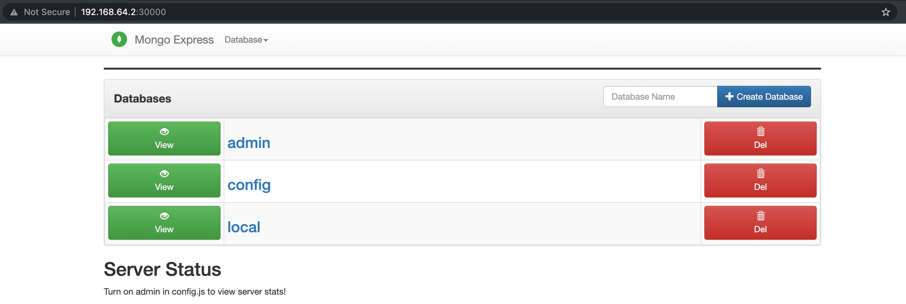

# demo-mongo-k8s


## Pre-requisites
* minikube

## Running

#### Create Secret
`kubectl apply -f mongo-secret.yaml`

#### Create ConfigMap
`kubectl apply -f mongo-configmap.yaml`

#### Create mongo service & deployment
`kubectl apply -f mongo.yaml`

#### Create mongo-express service & deployment
`kubectl apply -f mongo-express.yaml`

#### Get mongo-express URL
`minikube service list -n default`
```
|-----------|-----------------------|--------------|---------------------------|
| NAMESPACE |         NAME          | TARGET PORT  |            URL            |
|-----------|-----------------------|--------------|---------------------------|
| default   | kubernetes            | No node port |
| default   | mongo-express-service |         8081 | http://192.168.64.2:30000 |
| default   | mongodb-service       | No node port |
|-----------|-----------------------|--------------|---------------------------|
```