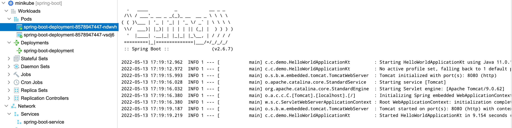

# demo-docker-k8s

## Pre-requisites
* JDK 11
* Docker
* minikube

## Running

#### Build jar file
`./gradlew build`

#### Build image
`docker build -t chuangcius/demo:0.0.1-SNAPSHOT .`

#### Push image to Docker repository
`docker push chuangcius/demo:0.0.1-SNAPSHOT`

#### Create namespace in k8s
` kubectl apply -f k8s/ns.yml`

#### Create deployment in k8s
` kubectl apply -f k8s/deployment.yml`

#### Create service in k8s
` kubectl apply -f k8s/service.yml`